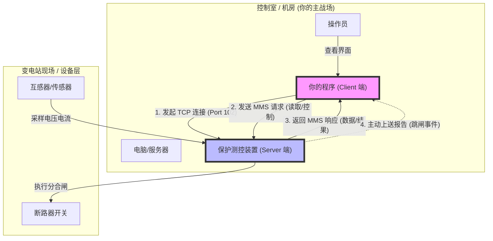

# IEC 61850 MMS 快速掌握指南 (1天突击版)

本指南专为“1天内掌握核心概念并应对面试”设计。重点在于理解**数据模型**和**通信机制**，而不需要去背诵底层的报文二进制格式。

---

## 0. 极速入门：谁是客户端，谁是服务端？

这是最容易混淆的地方，因为这与此时的“谁在服务谁”有关。最简单的对应关系如下：

* **Server (服务端) = 现场设备 (IED)**
  * **实体**: 这通常是个**硬件盒子**（嵌入式设备），安装在变电站的柜子里，比如保护装置、测控装置。
  * **角色**: 它**拥有**数据（电压、电流、开关状态）。它负责采集现场的电力信号，并提供给上位机，所以它是“数据的提供者（Server）”。
  * **行为**: 它等待连接。一旦连接建立，它响应读取请求，或者根据配置主动上送报告。

* **Client (客户端) = 监控系统 (SCADA / 网关 / 你的代码)**
  * **实体**: 这通常是一台**电脑**、**工控机**或**服务器**。
  * **角色**: 它**想要**数据。它需要把数据显示给操作员，或者存入数据库。
  * **行为**: 它主动发起连接（TCP Connect IP:102）。

### 0.1 物理架构与通信流程图

### 0.2 软件开发具体负责什么？

作为一个应用层软件开发（非嵌入式），你通常是在开发 **Client (客户端)**：

1. **连接管理**: 写代码去连接现场几百台设备的 IP。
2. **模型解析**: 第一次连接时，读取设备里的“目录结构”（LD/LN/DO），知道设备里有哪些数据。
3. **数据采集**:
    * **轮询**: 定时发包问“电压多少？”
    * **监听报告**: 一直挂着连接，等着设备主动推“变位信号”过来。
4. **业务处理**: 把收到的 `220.5` 存进数据库，或者在界面上把开关画成红色。

---

## 1. 核心概念：面向对象建模 (Object-Oriented Modeling)

传统的通信协议（如 Modbus）是“面向点位”的（地址 40001 代表什么，全靠文档约定）。
**IEC 61850 是“面向对象”的**，它把物理设备抽象成了一棵有自我描述能力的逻辑树。

### 1.1 数据层级结构 (The Hierarchy)

请记住这 5 层结构，这是面试必问的“地图”：

1. **Server (服务端)**: 代表整个物理设备（如一个保护测控装置）。
2. **Logical Device (LD, 逻辑设备)**: 装置内的功能分区（如 "Protection", "Measurement"）。
3. **Logical Node (LN, 逻辑节点)**: **核心单元**。代表一个不可分割的功能块。
    * `MMXU`: 测量 (Measurement) - 如下面的电压、电流。
    * `XCBR`: 断路器 (Circuit Breaker) - 控制开关分合。
    * `CSWI`: 开关控制器 (Switch Controller)。
    * `GGIO`: 通用IO (General IO)。
4. **Data Object (DO, 数据对象)**: 逻辑节点下的具体数据对象。
    * 例如 `MMXU` 下的 `PhV` (相电压)。
5. **Data Attribute (DA, 数据属性)**: 数据的具体值、质量或时间戳。
    * 例如 `PhV` 下的 `mag` (幅值) -> `f` (浮点数值)。

### 1.2 理解“自描述”

在 Modbus 中，你读到 `100`，你不知道它是电压还是电流。
在 61850 中，你通过路径访问：
`MyDevice/Measurement/MMXU1.PhV.phsA.cVal.mag.f`
(装置/计量分区/测量节点1.相电压.A相.复数值.幅值.浮点数)

> **面试话术**：
> "我理解 61850 的核心在于其**面向对象的建模思想**。它抛弃了传统的‘点位表’模式，而是使用 **LD/LN/DO/DA** 这种树状结构来描述设备。比如标准的逻辑节点 **MMXU** 用于测量，**XCBR** 用于断路器控制，这种标准化建模让不同厂家的设备可以无缝互操作，Client 端可以直接读取模型的结构，实现了**自我描述**。"

---

## 2. 核心机制：报告服务 (Reports / RCB)

MMS (Manufacturing Message Specification) 是 61850 在站控层使用的应用层协议。除了“读/写”数据，最重要的就是**报告 (Reporting)**。

### 2.1 轮询 (Polling) vs 报告 (Reporting)

* **轮询 (Modbus模式)**: 主站不停地问：“如果你变了告诉我”。浪费带宽，实时性差。
* **报告 (61850模式)**: 主站告诉子站：“如果你发生了 **dchg (数据变化)** 或 **qchg (质量变化)**，主动发消息给我”。

### 2.2 关键组件

1. **DataSet (数据集)**: 一个“购物车”。你把需要关注的数据（如 A相电压、开关位置、报警信号）打包放进一个 DataSet 里。
2. **Report Control Block (RCB, 报告控制块)**: “快递单”。它定义了何时发货、怎么发货。
    * **BRCB (Buffered, 带缓存)**: 即使通信中断，数据会存在装置里，重连后补发。用于**SOE (事件顺序记录)** 等不能丢失的重要数据。
    * **URCB (Unbuffered, 不带缓存)**: 通信断了数据就丢了。用于实时测量值（如电压电流，丢了就看新的）。
3. **Trigger Options (触发条件)**:
    * `dchg` (Data Change): 值变了就发。
    * `qchg` (Quality Change): 数据质量变了（如无效、闭锁）就发。
    * `duprd` (Data Update): 定期发（类似心跳）。
    * `gi` (General Interrogation): 总召唤。主站刚连上时，手动触发一次，把所有状态全刷一遍。

> **面试话术**：
> "我熟悉 MMS 的**报告服务机制**。相比于低效的轮询，我能熟练处理基于 **DataSet** 和 **RCB** 的事件驱动通信。特别是明白 **BRCB (带缓存)** 和 **URCB (不带缓存)** 的区别以及应用场景：BRCB 用于防丢包的重要事件（如 SOE），URCB 用于实时遥测。我也处理过 **GI (总召唤)** 流程，确保断链重连后的数据同步。"

---

## 3. 面试实战：如何体现“具备集成能力”

如果面试官问：“这里有个新厂家的 61850 装置，你如何接入？”

**回答逻辑 (SCL -> 模型 -> 绑定)：**

1. **解析 ICD/SCL 文件**: "首先，我会向厂家索要 **ICD (IED Capability Description)** 或 **SCL** 配置文件。这是设备的'身份证'。"
2. **模型解析与配置**: "我会使用配置工具（或代码库的解析器）读取 XML 格式的 SCL 文件，获取其中的 **Logical Device** 和 **Logical Node** 结构，定义好我们需要采集的 **DataSet**。"
3. **代码实现**:
    * "我主要使用 [开源库如 **libiec61850** / 或商业协议栈] 进行开发。"
    * "初始化 Client，连接 IP。"
    * "调用 `GetServerDirectory` 获取模型（或离线加载模型）。"
    * "**启用报告控制块 (Enable RCB)**，设置触发选项（dchg/qchg），并绑定回调函数来接收异步推送的数据。"
4. **调试排错**: "如果通不上，我会用 **MMS Lite** 或 **IEDScout** 等工具抓包，看是网络层问题，还是 OSI 七层模型中的参数协商问题。"

---

## 4. 1天复习总结卡片

| 概念 | 关键词 | 说明 |
| :--- | :--- | :--- |
| **层级** | Server/LD/LN/DO/DA | 树状结构，类似文件系统 |
| **LN 例子** | MMXU / XCBR | MMXU=测量，XCBR=断路器 |
| **MMS** | Top-down / Client-Server | 站控层使用的通信协议 |
| **报告** | RCB / DataSet | 既然是面向对象，就是由对象主动“汇报” |
| **BRCB** | **Buffered** (带缓存) | 断线重连**不丢数据** (SOE) |
| **URCB** | **Unbuffered** (无缓存) | 断线重连**丢弃旧数据** (遥测) |
| **文件** | **SCL / ICD / CID** | 基于 XML 的描述文件，是一切的起点 |
